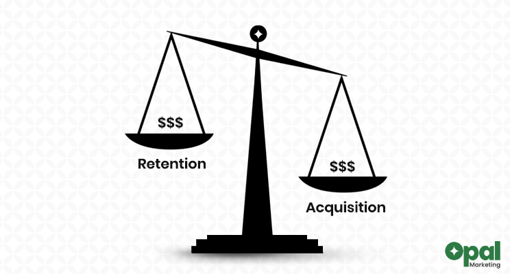

# Bank Customer Churn Prediction

This project aimed to develop a machine learning model capable of classifying customers who are likely to leave a bank. The dataset used for the project was sourced from [Kaggle](https://www.kaggle.com/datasets/gauravtopre/bank-customer-churn-dataset). The data was used to build a model capable of predicting customer churn with 76% recall on the test data.

# Project Background and Business Objective

The bank's data team observed a significant drop in revenue, directly attributed to a persistent increase in the customer churn rate. This project was initiated to address this financial impact by building a predictive solution.

**Objective**: The primary goal was to develop a machine learning model capable of accurately identifying customers at high risk of churning. This will enable the Marketing team to execute a proactive, targeted customer retention strategy, thereby reducing the high expenses associated with Customer Acquisition Cost (CAC) and Customer Retention Cost (CRC).

# Exploratory Analysis

The dataset, sourced from [Kaggle](https://www.kaggle.com/datasets/gauravtopre/bank-customer-churn-dataset), contains 10,000 customer records across 10 features. These features capture both customer demographics (e.g., age and gender) and banking activities (e.g., number of products used).

Initial inspection for data type mismatch, missing values, duplicates, and incorrect entries revealed no significant data quality issues.

### Key Insights from Exploratory Data Analysis (EDA)

The following are the some of the observation from EDA:

* The target variable (Exited) exhibits severe class imbalance, classifying this as an imbalanced classification problem. This directed the focus toward maximizing recall during evaluation.

* Churn appears to be notably more common among older customers.

* Customers who churn tend to utilize more than two banking products.

* Most customers have low account balance.

### Key Insights from Cluster Analysis

K-Means was used to identify 4 distinct customer segments that informed feature engineering. The following are observations from the clustering results:

* The customers were mainly separated by country. Specifically, all customers in Cluster 0 are from Germany, all customers in Cluster 3 are from Spain, and all customers in Clusters 1 and 2 are from France.

* Customers in Cluster 2 have a very low account balance compared to all other customers. This shows that the model was able to capture the multimodal distribution observed in the balance column during exploratory data analysis.

# Model Development

### Splitting Method and Evaluation Metrics

The data was initially split into training and testing sets using a stratified sampling method to preserve the class distribution in the target variable.

Recall was selected as the primary metric for model selection and tuning. Maximizing recall was essential to minimize False Negatives (i.e., failing to identify a customer who will churn), which directly aligns with the business objective of successful retention campaigns. Secondary metrics included Accuracy and Precision.

### Model Training and Selection

Four models were initially trained: Logistic Regression, Decision Tree, Random Forest, and Gradient Boosting.

The Gradient Boosting model demonstrated the strongest initial performance, achieving a recall of 0.476. The final model was developed through the following iterative optimization steps:

1. **Hyperparameter Tuning**: The learning rate was optimized to mitigate the risk of overfitting, resulting in a slight drop in recall (0.417).

2. **Feature Engineering**: Model performance was further enhanced by incorporating K-Means label and distance features, which improved recall to 0.427.

3. **Optimal Threshold Tuning**: Given the class imbalance, the model's prediction threshold was tuned to maximize recall across both positive and negative classes. This final step yielded the deployed model with a performance of 0.75 Recall and 0.51 Precision on the test set.

# Business Impact Assessment

To validate the model's utility, its financial impact was benchmarked against a naive baseline model (predicting no churn).

Assuming the bank spends 1000 euros on customer acquisition, and 200 euros on customer retention. If the marketing team's retention campaign is 100% effective, then based on the confusion matrix on of test data, implementing the predictive model is projected to help the bank reduce the overall combined CAC and CRC by 50.8%.

# Next Steps

The following steps are recommended to move the project toward full production and sustained impact:

* Collaborate with ML Engineers for model deployment into the production environment.

* Conduct further research to identify the most optimal number of clusters for the K-Means preprocessing step.

* Perform deeper hyperparameter search to find more optimal tree and ensemble parameters for the Gradient Boosting model.